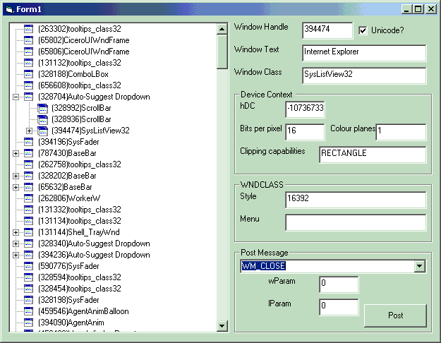



## Windows Messages demonstrator

### Description

This program allows you to send Windows Messages to any active window on the system in order to find out what happens when you do. Hours of fun...
 
### More Info
 
This code requires release 1.1.3 of the EventVB dll which can be downloaded free from http://www.merrioncomputing.com/Download/index.htm

             |
---                |---
**Submitted On**   |2001-08-14 20:14:34
**By**             |[Duncan Jones](https://github.com/Planet-Source-Code/PSCIndex/blob/master/ByAuthor/duncan-jones.md)
**Level**          |Intermediate
**User Rating**    |4.8 (24 globes from 5 users)
**Compatibility**  |VB 5\.0, VB 6\.0
**Category**       |[Windows API Call/ Explanation](https://github.com/Planet-Source-Code/PSCIndex/blob/master/ByCategory/windows-api-call-explanation__1-39.md)
**World**          |[Visual Basic](https://github.com/Planet-Source-Code/PSCIndex/blob/master/ByWorld/visual-basic.md)
**Archive File**   |[Windows Me246558142001\.zip](https://github.com/Planet-Source-Code/duncan-jones-windows-messages-demonstrator__1-26202/archive/master.zip)

